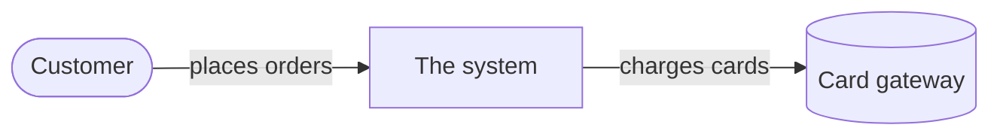

# 3. Context and scope

> **What goes here:** the system as a black box, the people and systems it talks to, and what is
> exchanged. This is the C4 **System Context** diagram.

| Neighbor | Input / output |
|---|---|
| _Customer_ | _Orders in, confirmations out_ |
