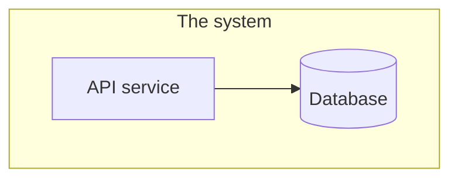

# 5. Building block view

> **What goes here:** the static decomposition. Level 1 is the C4 **Container** diagram (deployable
> units); go one level deeper only where it helps.

| Building block | Responsibility | Technology |
|---|---|---|
| _API service_ | _…_ | _…_ |
