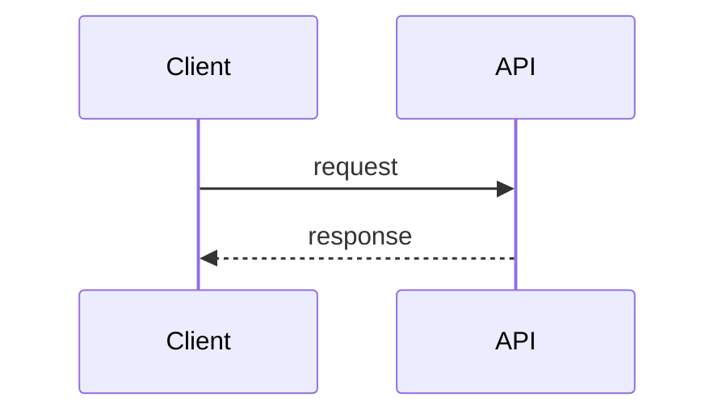

# 6. Runtime view

> **What goes here:** how the building blocks cooperate in the 2–4 most important or most risky
> scenarios, including failure scenarios. Sequence diagrams work well.

```mermaid
sequenceDiagram
    participant C as Client
    participant A as API
    C->>A: request
    A-->>C: response
```
